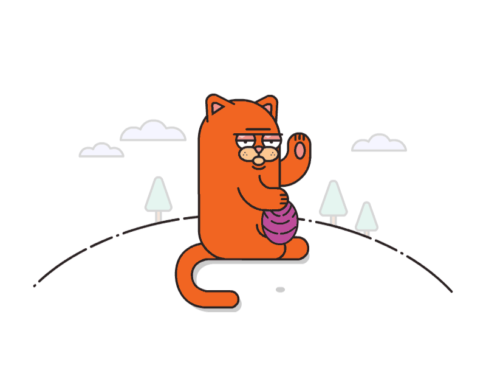

## Fun Fact 🎈: 

• 🔭 I’m currently working on <b>something cool</b>  
• 🌱 I’m currently learning <b>Everything</b> 
• 👯 I’m looking to collaborate on anything with cool idea 
• 💬 Ask me about <b>Full Stack</b> 
• 📫 Reach me at on instagram: <a href="https://www.instagram.com/vijaybahadurvns"><b>@VBITSVNS</b></a> 

 
 

## **Connect with me:**

<!-- 
 -->

 
 

## **Languages and Tools:**

[][repo]

[][repo]

[][repo]

[][repo]

[][repo]

[][repo]  
  
[][repo]

[][repo]

[][repo]

[][repo]

[][repo]

[][repo]

[][repo]

[][repo]

 

[repo]: https://github.com/vbitsvns?tab=repositories

 
 

## **Payment Support:**

